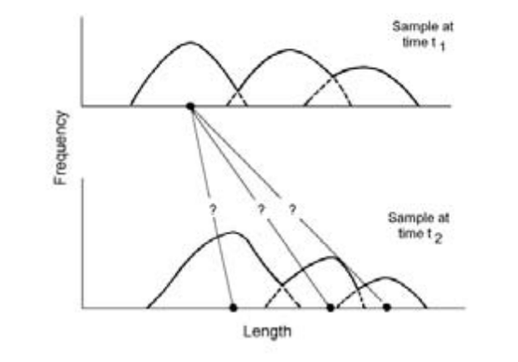
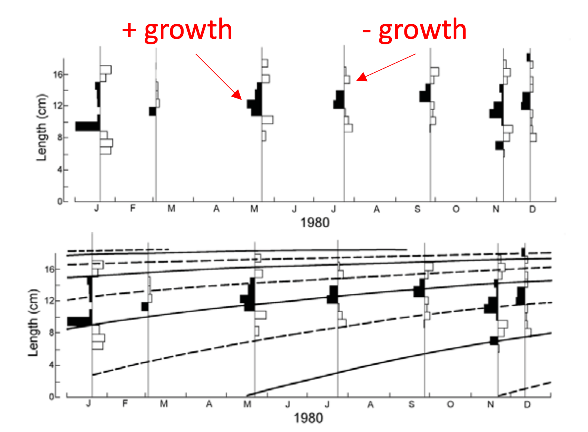

```{r setup1, echo=FALSE}
rm(list = ls())
set.seed(9)
knitr::opts_chunk$set(echo = TRUE,
                      message = FALSE,
                      warning = FALSE,
                      fig.align = 'center',
                      fig.width = 7,
                      fig.height = 5,
                      dev = 'jpeg',
                      dpi = 300)
#XQuartz is a mess, put this in your onload to default to cairo instead
options(bitmapType = "cairo") 
# (https://github.com/tidyverse/ggplot2/issues/2655)
# Lo mapas se hacen mas rapido
```


# Contexto


En este estudio, presentamos un enfoque metodológico para la estimación de parámetros clave de la historia de vida, como la longitud asintótica ($L_{\infty}$), el coeficiente de crecimiento ($K$) y la mortalidad natural ($M$), para la ostra europea *Ostrea edulis*, utilizando datos experimentales del proyecto Resalar llevado a cabo en el Mar Menor por el Instituto Español de Oceanografía (IEO) en Murcia. A partir de datos de frecuencia de longitudes recolectados durante el periodo experimental comprendido entre los años 2023 y 2024, aplicamos métodos metodos de Analisis de Progresión Modal usando ELEFAN [@Gayanilo2005] para ajustar curvas de crecimiento y estimar los parámetros de crecimiento. Con estos parametros, utilizamos una serie de metodos bioanalogogicos para calcular las tasas de mortalidad natural de la especie basada en escenarios de edad máxima.. 

Nuestros resultados proporcionan una visión de la dinámica de crecimiento de *Ostrea edulis* en este entorno lagunar y experimental, lo cual es fundamental para entender la dínamica del crecimiento de la especie. La combinación de diferentes métodos permite una comparación robusta de los parámetros estimados, contribuyendo a una mejor comprensión de los rasgos de la historia de vida de esta especie bajo las condiciones ambientales específicas del Mar Menor.

# Metodología

Un aspecto clave en el análisis de las poblaciones marinas y su dinámica es contar con estimaciones empíricas, confiables y actualizadas de los parámetros de historia de vida (LH), como el crecimiento y la mortalidad natural [@Clark1999; @Mannini2020; @Perreault2021].

Primero, calculamos \( L_{\infty} \) (longitud asintótica) y \( K \) (tasa de crecimiento) mediante un proceso conocido como Análisis de Progresión Modal. El **análisis de progresión modal** consiste en vincular los picos de la frecuencia de longitud muestreada en tiempos conocidos (\( t_1, t_2 \)) mediante incrementos de crecimiento (Figura \@ref(fig:1)).

```{r 1, echo=FALSE, out.width="50%", fig.cap= "Ejemplo esquemático del Análisis de Progresión Modal."}
 
```
Luego se ajustan las curvas mediante el Análisis Electrónico de Frecuencia de Longitud (ELEFAN). El **Análisis Electrónico de Frecuencia de Longitud** (ELEFAN) [@Gayanilo1997]  tiene como objetivo buscar una curva de crecimiento que se ajuste a los picos de los datos de frecuencia de longitud, logrando un ajuste óptimo, similar a los parámetros de una regresión lineal. En este caso se buscan los momentos de crecimiento positivo y negativo de la población  (Figura \@ref(fig:2)). Para ello, utilizamos tres algoritmos de ajuste, incluyendo:

- Ajustes mediante regresión lineal
- Algoritmo Genético (GA)
- Recocido Simulado (SA)


```{r 2, echo=FALSE, out.width="50%", fig.cap= "Metodos de ajustes para ELEFAN"}
 
```


### Cargar paquetes necesarios para la estimacion y vizualización.

```{r lib, message=F, echo= TRUE}
library(here)
library(kableExtra)
library(ggthemes)
library(ggrepel)
library(ggridges)
#analisis
library(ggpubr)
library(easystats) # multiples unciones analiticas
library(sf)
library(tidyverse, quietly = TRUE)
library(modelsummary)
library(terra) # replace raster
library(TropFishR)
library(mixR)
library(readxl)
```


### Manipulación de Data

Cargar datos provenientes del experimiento de REDSALAR, en el cual se recopilan estructuras de tallas mensuales.

```{r data}
# Restore the object
db <- read_excel(here("DATA",
                     "BD_lfd_crec_salinas.xlsx"),
                     sheet="TropFish")
```
Separate `Date` column

```{r dateformat}
# Asigno  columnas a fechas separadas.
db1<- db %>%
  mutate(
    DIA = day(Date),
    MES = month(Date),
    ANO = year(Date))

table(db1$ANO)
```
histogram length data to viz in another way.


simple grafica de progesión de las tallas de *O. edulis* muestreadas mensualmente durante el experimento entre los años 2023 y 2024.


```{r lengcom}
data1 <- ggplot(db1,
             aes(x=size,
                 y=as.factor(Date)))+
  facet_grid(~ANO,
             scales = "free_x")+
  geom_density_ridges(stat = "binline", bins = 30, 
                      scale = 1.2, 
                      draw_baseline = T,
                      alpha=0.5,
                      fill="blue")+  
  theme_few()+
  theme(legend.position = "none",
        axis.text = element_text(angle = 90))+
  xlab("Length (mm.)")+
  ylab("")+
  coord_flip()
data1
```

Statistical difference between month

```{r}
m <- aov(sizeE ~ Sampling.point, data=db1)
```


```{r eval=FALSE}
plot(TukeyHSD(m))
```


```{r}
# Convertir la variable categórica a factor
db1$Sampling.point <- as.factor(db1$Sampling.point)
# Ajustar el modelo ANOVA
m <- aov(size ~ Sampling.point, data = db1)
# Aplicar TukeyHSD
tukey_result <- TukeyHSD(m)
```

Líneas horizontales (Intervalos de confianza):

Cada línea representa el intervalo de confianza para la diferencia de medias entre dos grupos. Cuanto más amplio es el intervalo, mayor es la incertidumbre en la estimación. Si un intervalo de confianza cruza el cero (es decir, incluye el cero), significa que la diferencia entre las medias de los dos grupos no es estadísticamente significativa.

Puntos medios de las líneas:

Los puntos medios de las líneas horizontales representan la diferencia estimada de medias entre los dos grupos comparados.

Significancia:

Las líneas que están completamente por encima o por debajo del cero indican que hay una diferencia estadísticamente significativa entre las medias de los dos grupos, ya que el cero no está incluido en el intervalo de confianza. Las líneas que cruzan el cero indican que no hay una diferencia significativa entre las medias de los dos grupos.

Grupos comparados:

En el eje y, verás los pares de grupos que se comparan, generalmente escritos en el formato "Grupo1-Grupo2". Cada par corresponde a uno de los intervalos de confianza en el gráfico.

Cómo interpretar el gráfico:

Si una línea horizontal no cruza el cero, la diferencia entre los grupos correspondientes es significativa al nivel de confianza dado (normalmente 95%). Si una línea horizontal cruza el cero, no hay una diferencia significativa entre esos dos grupos. Cuanto más larga sea la línea horizontal, mayor es la variabilidad o incertidumbre en la diferencia estimada.

### Análisis estadístico de modas

First we use `mixR` [@Yu2021a] to identified numbers of component (modal compositions). With this result, set `ELEFAN` method


```{r}
# Saco los NA
filtered_db <- db1 %>% 
    drop_na(size)
# select number of components
s_normalgs = select(filtered_db$size, ncomp = 1:8)
plot(s_normalgs)
```
The final model: normal mixture (unequal variances) with 3 components, but, by common sense we select 5 components modals.

```{r}
# Definir el número de componentes
ncomp <- 5
# Definir medias entre 20 y 70 cm (por ejemplo, espaciadas uniformemente)
medias <- seq(30, 70, length.out = ncomp)
# Definir pesos iniciales (uniformes)
pesos <- rep(1/ncomp, ncomp)  
# Definir desviaciones estándar iniciales (puedes ajustarlas según tus datos)
desviaciones <- rep(1, ncomp) 
# Ajustar el modelo de mezcla
modgs <- mixfit(filtered_db$size, 
                ncomp = ncomp, 
                pi = pesos, 
                mu = medias, 
                sd = desviaciones)
```


```{r}
# Graficar el ajuste
plot(modgs,
     smoothness = 300,
     theme = "bw",
     trans=0.4)

```

###  Estimación de parametros `k` and `L_inf_` para *O. edulis*

Preparamos el objeto para la estimación 

```{r}
db1$Date <- as.Date(db1$Date)
  # Crear un objeto lfq para el ID actual
lfq <- lfqCreate(data = db1,
                   Lname = "size",
                   Dname = "Date",
                   bin_size = 0.1,
                 length_unit = "mm",
                 Lmin = 0.8,
                 aggregate_dates=T)

# Graficar el objeto lfq
plot(lfq, Fname = "catch",
       main = "Ostrea edulis")

```
Utilizamos un metodo de Battacharya [@Mildenberger2017] para identificar las frecuencias relativas y la distribución de frecuencia de distintas cohortes en la distribución observada de frecuencias de longitud, resolviéndola en componentes gaussianos.

```{r message=FALSE}
Bhattacharya(lfq,
             n_rnorm = 3000)
```


Ahora asignamos los objetos `lfq_result` y ploteamos con `lfqRestructure()` usando el formato de @Gayanilo2005; @Pauly1987 y el reciente trabajo de @Mildenberger2017

(Documentation) Restructuring of length frequency data

First step of the *Electronic LEngth Frequency ANalysis (ELEFAN)*, which is restructuring length-frequency data (lfq). This is done according to a certain protocol, described by many authors (see Details or References for more information).


```{r}
# Restructurar el objeto lfq
lfqbin <- lfqRestructure(lfq, 
                         MA = 5, 
                         addl.sqrt = F)
# Graficar el objeto lfq reestructurado
plot(lfqbin, hist.col = c("white", "black"),
     image.col = c(rep(rgb(1,0.8,0.8),1000), "white", 
                   rep(rgb(0.8,0.8,1),1000)),
       ylim = c(0,max(lfqbin$midLengths)))
  # Ajustar curvas al objeto lfq reestructurado
  tmp <- lfqFitCurves(lfqbin, par = list(Linf=7.9, 
                                          K=0.7,
                                          t_anchor=0.1),
                      draw = TRUE, col=4, lty=2)
```


Procedemos a calcular con los tres metodos dispuestos por `TropFishR` package para etsimación de parametros de LH, en este caso, `ELEFAN`, `ELEFAN_SA` (Electronic LEngth Frequency ANalysis with simulated annealing for estimating growth parameters) y `ELEFAN_GA` (Electronic LEngth Frequency ANalysis with genetic algorithm used for estimating growth parameters). Estos últimos dos métodos son conceptos metodologicos en el proceso de estimación a través de los algoritmos, desarrollasos en funcion de optimizar los recursos computacionales. 

Seteo parametros comunes para la estimacion. 

`Linf_range`: Para hacer que ELEFAN sea comparable con los otros métodos, he ajustado `Linf_range` a seq(7.0, 8.0, 0.1) para que coincida con los límites de low_par y up_par en los otros métodos.
`K_range`: Utilicé el mismo rango de K para los tres métodos, con valores entre 0.01 y 0.9. 

En los tres métodos, he activado la estacionalidad (`seasonalised = TRUE` en `ELEFAN_SA` y `ELEFAN_GA`) y utilicé valores de `C` = 0 y `ts` = 0.5 para asegurar la coherencia. Estos parametros dicen relaciñon con la oscilacion estacional fdel crecimiento, información que para *O. edulis* no tenemos y por eso la dejamos en la mitad del año.

Los límites inferiores (`low_par`) y superiores (`up_par`) son consistentes entre los tres métodos.
init_par en ELEFAN_SA:

Establecer los valores iniciales para `Linf`, `K`, `t_anchor`, `C` y `ts` en `ELEFAN_SA` para ser consistentes con los otros métodos.


```{r}
# set param
Linf_range <- seq(7.0, 8.0, 0.1)
K_range <- exp(seq(log(0.01),
                   log(0.9),
                   length.out = 50)) # Coincide con los otros métodos

low_par <- list(Linf = 7.0,
                K = 0.1, 
                t_anchor = 0, 
                C = 0, 
                ts = 0)
up_par <- list(Linf = 8.0, 
               K = 0.9, 
               t_anchor = 1,
               C = 1, 
               ts = 1)
init_par <- list(Linf = 7.5,
                 K = 0.5, 
                 t_anchor = 0.5,
                 C = 0.5, 
                 ts = 0.5)
```


Procedemos con el calculo de parametros y verificamos sus diferencias.

Primero estimaremos los parametros con las edades propuestas por el equipo *Resalar*, donde establecen que La edad máxima especie según Stenzel (1971) es de 26-27 años. (Me faltan estas referencias)


```{r eval=FALSE, message=FALSE, warning=FALSE}
# Método 1: ELEFAN con optimización
res_simple <- ELEFAN(lfq,
                     Linf_fix = NA,
                     Linf_range = Linf_range, # Coincide con otros métodos
                     K_range = K_range, # Coincide con otros métodos
                     C = 0,  # Estacionalidad
                     ts = 0.5, # Valor inicial de ts
                     MA = 1,
                     addl.sqrt = FALSE,
                     agemax = 26,
                     flagging.out = TRUE,
                     method = "optimise",
                     cross.date = NULL,
                     cross.midLength = NULL,
                     cross.max = FALSE,
                     hide.progressbar = FALSE,
                     plot = FALSE,
                     contour = FALSE,
                     add.values = TRUE,
                     rsa.colors = terrain.colors(20),
                     plot_title = TRUE)

# Método 2: ELEFAN con Simulated Annealing (SA)
res_SA <- ELEFAN_SA(lfq,
                    SA_time = 60 * 0.5,
                    MA = 1,
                    agemax = 26,
                    seasonalised = TRUE,  # Estacionalidad activada
                    addl.sqrt = FALSE,
                    init_par = init_par, # Valores iniciales comunes
                    low_par = low_par,   # Limites inferiores comunes
                    up_par = up_par,     # Limites superiores comunes
                    plot = FALSE,
                    plot.score = FALSE)

# Método 3: ELEFAN con algoritmo genético (GA)
res_GA <- ELEFAN_GA(lfq,
                    MA = 1,
                    seasonalised = TRUE,  # Estacionalidad activada
                    maxiter = 50,
                    agemax = 26,
                    addl.sqrt = FALSE,
                    low_par = low_par,  # Limites inferiores comunes
                    up_par = up_par,    # Limites superiores comunes
                    monitor = FALSE,
                    plot = FALSE)

```

Guardo los resultados del escenario de 26 años

```{r eval=FALSE}
save(res_simple, 
     res_SA, 
     res_GA, 
     file = "results/elefan26_results.RData")
```


Ahora leo los archivos

```{r}

# Verifica si el archivo "elefan_results.RData" existe en la carpeta "results" y carga los datos
if (file.exists("results/elefan26_results.RData")) {
  load("results/elefan26_results.RData")
} else {
  stop("no read")
}

```


Ahora estimaremos con lo encontrado en Rosique (1994) en el Mar Menor reportando una edad máxima  de 5 años 

```{r eval=FALSE, message=FALSE, warning=FALSE}
# Método 1: ELEFAN con optimización
res_simple_5 <- ELEFAN(lfq,
                     Linf_fix = NA,
                     Linf_range = Linf_range, # Coincide con otros métodos
                     K_range = K_range, # Coincide con otros métodos
                     C = 0,  # Estacionalidad
                     ts = 0.5, # Valor inicial de ts
                     MA = 1,
                     addl.sqrt = FALSE,
                     agemax = 5,
                     flagging.out = TRUE,
                     method = "optimise",
                     cross.date = NULL,
                     cross.midLength = NULL,
                     cross.max = FALSE,
                     hide.progressbar = FALSE,
                     plot = FALSE,
                     contour = FALSE,
                     add.values = TRUE,
                     rsa.colors = terrain.colors(20),
                     plot_title = TRUE)

# Método 2: ELEFAN con Simulated Annealing (SA)
res_SA_5 <- ELEFAN_SA(lfq,
                    SA_time = 60 * 0.5,
                    MA = 1,
                    agemax = 5,
                    seasonalised = TRUE,  # Estacionalidad activada
                    addl.sqrt = FALSE,
                    init_par = init_par, # Valores iniciales comunes
                    low_par = low_par,   # Limites inferiores comunes
                    up_par = up_par,     # Limites superiores comunes
                    plot = FALSE,
                    plot.score = FALSE)

# Método 3: ELEFAN con algoritmo genético (GA)
res_GA_5 <- ELEFAN_GA(lfq,
                    MA = 1,
                    seasonalised = TRUE,  # Estacionalidad activada
                    maxiter = 50,
                    agemax = 5,
                    addl.sqrt = FALSE,
                    low_par = low_par,  # Limites inferiores comunes
                    up_par = up_par,    # Limites superiores comunes
                    monitor = FALSE,
                    plot = FALSE)

```


Guardo los resultados del escenario de 26 años

```{r eval=FALSE}
save(res_simple_5, 
     res_GA_5, 
     res_SA_5, 
     file = "results/elefan5_results.RData")
```


Ahora leo los archivos

```{r}
if (file.exists("results/elefan5_results.RData")) {
  load("results/elefan5_results.RData")
} else {
  stop("no read")
}

```

Extraigo los parámetros para cada escenario de estimación.


```{r}
# made table
SI <- unlist(res_simple$par)
GA <- unlist(res_GA$par)
SA <- unlist(res_SA$par)
SI5 <- unlist(res_simple_5$par)
GA5 <- unlist(res_GA_5$par)
SA5 <- unlist(res_SA_5$par)
```


Construyo las tablas para estimación con max age = 26

```{r}
# join 
t_k_linf_m <- rbind(GA[1:2],
                  SA[1:2],
                  SI[1:2])

row_names <- c("GA Method", "SA Method", "Simple Method")
rownames(t_k_linf_m) <- row_names
col_names_m <- c("L_inf", "K")
colnames(t_k_linf_m) <- col_names_m

total_r <- as.data.frame(round(t_k_linf_m,3))

t_k_linf_total <- as_tibble(total_r, rownames = "group")

# Calculo medias
total_r_m <- t_k_linf_total %>%
  bind_rows(
    tibble(
      group = "Mean",
      L_inf = mean(t_k_linf_total$L_inf),
      sd_L_inf = sd(t_k_linf_total$L_inf),
      K = mean(t_k_linf_total$K),
      sd_K = sd(t_k_linf_total$K)           
    )
  )

total_r_m  %>%
  separate(group, into = c("METHOD"), sep = " ") %>% 
  kbl(booktabs = T,
      position="ht!",
    caption = "Parametres LH to O. edulis with 26 age max") %>%
  kable_styling(latex_options = c("striped",
                                  "condensed"),
                full_width = FALSE)
```
Construyo las tablas para estimación con max age = 5

```{r}
# join 
t_k_linf_5 <- rbind(GA5[1:2],
                  SA5[1:2],
                  SI5[1:2])

row_names <- c("GA Method", "SA Method", "Simple Method")
rownames(t_k_linf_5) <- row_names
col_names_5 <- c("L_inf", "K")
colnames(t_k_linf_5) <- col_names_5

total_r_5 <- as.data.frame(round(t_k_linf_5,3))

t_k_linf_total_5 <- as_tibble(total_r_5, rownames = "group")

# Calculo medias
total_r_m_5 <- t_k_linf_total_5 %>%
  bind_rows(
    tibble(
      group = "Mean",
      L_inf = mean(t_k_linf_total_5$L_inf),
       sd_L_inf = sd(t_k_linf_total_5$L_inf),
      K = mean(t_k_linf_total_5$K),
      sd_K = sd(t_k_linf_total_5$K)           
    )
  )

total_r_m_5  %>%
  separate(group, into = c("METHOD"), sep = " ") %>% 
  kbl(booktabs = T,
      position="ht!",
    caption = "Parametres LH to O. edulis with 5 age max") %>%
  kable_styling(latex_options = c("striped",
                                  "condensed"),
                full_width = FALSE)
```
Made VB curves by methot and strata by male

separated group


```{r}
t_k_linf_sep <- total_r_m %>% 
   separate(group, into = c("METHOD"), sep = " ")

t_k_linf_sep_5 <- total_r_m_5 %>% 
   separate(group, into = c("METHOD"), sep = " ")
```


Generar curvas de crecimiento con estimados.

Primero creo la funcide crecimiento de VB comun para ambos cálculos

```{r}
# Definir la función de Von Bertalanffy
von_bertalanffy <- function(t, L_inf, K) {
  L_inf * (1 - exp(-K * (t-t0)))
}
```


Curvas para estimaciones basadas en age Max 26

```{r}
# Generar una secuencia de tiempos (por ejemplo, de 0 a 26 años)
t0 <- -0.3
time <- seq(0, 26, by = 1)

# Calcular longitud esperada para cada zona y tiempo
df_curves <- t_k_linf_sep %>%
  dplyr::select(c(1:3, 2:3)) %>% 
  rowwise() %>%
  mutate(length = list(von_bertalanffy(time, `L_inf`, `K`))) %>%
  unnest(length)
# Agregar el vector de tiempo al DataFrame df_curves
df_curves$time <- rep(time, nrow(t_k_linf_sep))
# Graficar con ggplot
age26 <- ggplot(df_curves,
               aes(x = time, 
                              y = length,
                              colour=METHOD)) +
  geom_point()+
  geom_line()+
  labs(title = "Estimation with 26 Age Max",
       x = "years",
       y = "Length (mm)") +
  theme_few()+
  scale_colour_viridis_d(option="C",
                         name="Method")+
  scale_x_continuous(breaks = seq(min(df_curves$time), 
                                  max(df_curves$time), 
                                  by = 1))  # Ajusta el intervalo según sea necesario


```


AHora Curvas para estimaciones basadas en age Max 5

```{r}

# Generar una secuencia de tiempos (por ejemplo, de 0 a 5 años)
t0 <- -0.3
time <- seq(0, 5, by = 0.1)

# Calcular longitud esperada para cada zona y tiempo
df_curves_5 <- t_k_linf_sep_5 %>%
  dplyr::select(c(1:3, 2:3)) %>% 
  rowwise() %>%
  mutate(length = list(von_bertalanffy(time, `L_inf`, `K`))) %>%
  unnest(length)
# Agregar el vector de tiempo al DataFrame df_curves
df_curves_5$time <- rep(time, nrow(t_k_linf_sep_5))
# Graficar con ggplot
age5 <- ggplot(df_curves_5,
               aes(x = time, 
                              y = length,
                              colour=METHOD)) +
  geom_line()+
  geom_point()+
 labs(title = "Estimation with 5 Age Max",
       x = "years",
       y = "Length (mm)") +
  theme_few()+
  scale_colour_viridis_d(option="C",
                         name="Method")+
   scale_x_continuous(breaks = seq(min(df_curves$time), 
                                  max(df_curves$time), 
                                  by = 0.5))

```

both plot

```{r}
ggarrange(age26, age5, common.legend = TRUE,
          ncol=2,
          legend="bottom")
```


## Mortalidad Natural para *O. edulis*

En este cálculo de Mortalidad natural mediante diferentes metodos bioanalogicos, probamos ambos escenarios de edades y sus respectivos calculos de parametros para la ostra del experimento.

La mortalidad natural (\( M \)) es un parámetro esencial en la gestión de poblaciones de peces. Existen varios métodos bioanalógicos para estimar \( M \) en función de características biológicas. A continuación, se describen algunos de estos métodos junto con sus respectivas fórmulas. 


1. Método de Pauly [@Pauly1980a] (Pauly_Linf)

El método de Pauly relaciona la mortalidad natural con la longitud asintótica (\( L_{\infty} \)), la tasa de crecimiento (\( K \)) y la temperatura media del hábitat (\( T \)).

\[
M = 10^{-0.0066 - 0.279 \log_{10}(L_{\infty}) + 0.6543 \log_{10}(K) + 0.4634 \log_{10}(T)}
\]

2. Método de Hoenig [@Hoenig1983]

Hoenig propuso una relación empírica entre \( M \) y la longevidad máxima (\( t_{max} \)) de los peces.

\[
M = 4.22 / t_{max}
\]

3. Método de Alverson y Carney [@Alverson1975]

Este método utiliza la relación entre \( M \) y el tamaño asintótico.

\[
M = 1.5 / \sqrt{L_{\infty}}
\]

4. Método de Rikhter y Efanov [@Rikhter1976]

Rikhter y Efanov relacionan la mortalidad natural con la edad de madurez sexual (\( t_m \)).

\[
M = 1.521 / t_m^{0.72} - 0.155
\]

5. Método de Gunderson y Dygert [@GundersonDygert1988]

Este método utiliza la proporción de peso de los ovarios (\( W_g \)) en relación con el peso total del pez.

\[
M = 3.0 \cdot W_g
\]

6. Método de Lorenzen [@Lorenzen1996]

Este método relaciona \( M \) con el peso corporal (\( W \)) del pez.

\[
M = 3 \cdot W^{-0.288}
\]

7. Método de Peterson y Wroblewski [@PetersonWroblewski1984]

Peterson y Wroblewski propusieron una relación entre \( M \) y el peso corporal (\( W \)) del pez.

\[
M = 1.92 \cdot W^{-0.25}
\]

8. Método de Roff [@Roff1984]

El método de Roff se basa en la relación entre \( M \) y la edad de madurez sexual.

\[
M = 1.03 / t_m
\]

9. Método de Then [@Then2015]

Then propuso una fórmula que usa la tasa de crecimiento (\( K \)) para estimar \( M \).

\[
M = 4.899 \cdot K^{0.914}
\]

10. Método de Then [@Then2015]

Otra fórmula propuesta por Then usa la longevidad máxima (\( t_{max} \)) para estimar \( M \).

\[
M = 4.118 / t_{max}^{0.73}
\]

Una vez descritops los métodos, procedemos a calcular el parametro de Mortalidad natural para los resultados de ambos escenarios relativos a las edades 5 y 26 usando la función `M_empirical` de la librería `TropfishR`.

M para escenario con edad 26 para *O. edulis*

```{r}
# use the function M_empirical to estimate natural mortality
M26 <- M_empirical(Linf = t_k_linf_sep$L_inf[4], K_l = t_k_linf_sep$K[4], 
                     tmax = 28, 
                     temp = 18,
                     GSI = 20.04,
                     tm50 = 2,
                     Wdry = 243.49,
                     Wwet = 309.31,
                  method = c("Pauly_Linf", 
                             "Hoenig", 
                             "AlversonCarney",
                             "RikhterEfanov",
                            "GundersonDygert",
                            "Hoenig", 
                            "Lorenzen", 
                            "PetersonWroblewski", 
                            "RikhterEfanov", 
                            "Roff",
                            "Then_growth", 
                            "Then_tmax"
                             ))
```


Ahora calculo M con parámetros con edades de 5.

```{r}
# use the function M_empirical to estimate natural mortality
M5 <- M_empirical(Linf = t_k_linf_sep_5$L_inf[4], K_l = t_k_linf_sep_5$K[4], 
                  tmax = 28, 
                     temp = 18,
                     GSI = 20.04,
                     tm50 = 2,
                     Wdry = 243.49,
                     Wwet = 309.31,
                  method = c("Pauly_Linf", 
                             "Hoenig", 
                             "AlversonCarney",
                             "RikhterEfanov",
                            "GundersonDygert",
                            "Hoenig", 
                            "Lorenzen", 
                            "PetersonWroblewski", 
                            "RikhterEfanov", 
                            "Roff",
                            "Then_growth", 
                            "Then_tmax"
                             ))
```

Junto las bases y saco el promedio

```{r}
# junto las bases


Total_M <- cbind(M5, M26)
colnames(Total_M) <- c("Age Max 5", "age Max 26")
mean_m <- colMeans(Total_M, na.rm = TRUE)
sd_m <- apply(Total_M, 2, sd, na.rm = TRUE)  
Total_M_Mean <- rbind(Total_M, 
                      Mean = round(mean_m, 3), 
                      SD = round(sd_m, 3))  


```
Hago la Tabla

```{r}
Total_M_Mean %>% 
  kbl(booktabs = TRUE,
      position = "ht!",
      caption = "Estimated M w/ different age") %>%
  kable_styling(latex_options = c("striped", "condensed"), 
                full_width = FALSE) %>% 
  pack_rows("Resumen", 
            start_row = nrow(Total_M_Mean) - 1, 
            end_row = nrow(Total_M_Mean),
            bold = TRUE)

```

Manipulo para hacer los plots

```{r}
df_M <- as.data.frame(Total_M_Mean)

df_M$Method <- rownames(Total_M_Mean)

df_long <- df_M %>%
  pivot_longer(cols = `Age Max 5`:`age Max 26`,   
               names_to = "Age", 
               values_to = "Value")
```

ahora una vizualización simple

```{r fig.width=7}
# Dot Plot
m_plot <- ggplot(df_long %>% 
                   drop_na() %>% 
                   filter(Method != "Mean"), 
                 aes(x = Age, 
                     y = Value, 
                     fill = Method)) +
  geom_point(size = 3,     
             shape = 21,   
             color = "black") +
  geom_text_repel(aes(label = round(Value, 3)),  
                  size = 3,                     
                  box.padding = 0.5,   
                 
                  direction = "x") +  # Alinea las etiquetas horizontalmente
  labs(title = "Estimating M in O. edulis by Age Max",
       x = "",
       y = "Natural Mortality",
       fill = "Method") +
  theme_few() +
  scale_fill_viridis_d(option = "H") +
  ylim(0, 1.5)

m_plot

```


Statistical diferences betweenm (work in progress)

```{r eval=FALSE, echo = FALSE}
# Realizar la prueba ANOVA
anova_result <- aov(Value ~ Stratum, data = df_long_male %>% drop_na())
summary(anova_result)
# Realizar la prueba post hoc de Tukey
tukey_result <- TukeyHSD(anova_result)
# Convertir los resultados de Tukey a un data frame
tukey_df <- as.data.frame(tukey_result$Stratum)
tukey_df$pair <- rownames(tukey_df)
tukey_df <- tukey_df %>%
  mutate(Stratum1 = sapply(strsplit(pair, "-"), `[`, 1),
         Stratum2 = sapply(strsplit(pair, "-"), `[`, 2))

# Seleccionar las columnas relevantes
tukey_table <- tukey_df %>%
  dplyr::select(Stratum1, Stratum2, diff, `p adj`, `lwr`, `upr`) %>%
  rename(Difference = diff, 
         P_value = `p adj`, 
         Lower_CI = `lwr`, 
         Upper_CI = `upr`)


kbl(tukey_table, 
    caption = "Test to differences between strata")  |> 
  kable_classic(full_width = F, 
                html_font = "Cambria") |> 
  kable_styling(bootstrap_options = "striped", 
                latex_options = "striped")


```


# Referencias

Albentosa, M., Akinyemi, M.I., Vera, M., Ibarrola, I., Filgueira, R., Galimany, E. et al. (2023). Recovery of eutrophized marine ecosystems using the European flat oyster, Ostrea edulis. Aquatic Conservation: Marine and Freshwater Ecosystems, 33(7), 645-660.

Bayne, B.L. (2017). Biology of oysters. San Diego, CA: Academic Press.

Cole, H.A. (1942). Primary Sex-Phases in Ostrea edulis. J Cell Sci 1 September; s2-83 (331): 317–356. doi: https://doi.org/10.1242/jcs.s2-83.331.317

Conesa, H.M. & Jiménez-Cárceles, F.J. (2007). The Mar Menor lagoon (SE Spain): A singular natural ecosystem threatened by human activities. Marine Pollution Bulletin, 54(7), 839-849.

Rosique, M.J. 1994. Estudio del banco de ostra plana (Ostrea edulis L.) del Mar Menor: posibilidades de explotación. PhD thesis, Universidad de Murcia.

Stenzel HB (1971) Oysters. In: Moore RC (ed) Treatise on invertebrate paleontology, Part N, Bivalvia. Geological Society of America, Boulder, pp N953–N1224

Velasco, J., Lloret, J., Millán, A., Marin, A., Barahona, J., Abellán, P. et al. (2006). Nutrient and particulate inputs into the Mar Menor lagoon (SE Spain) from an intensive agricultural watershed. Water, Air, and Soil Pollution, 176(1-4), 37-56.


